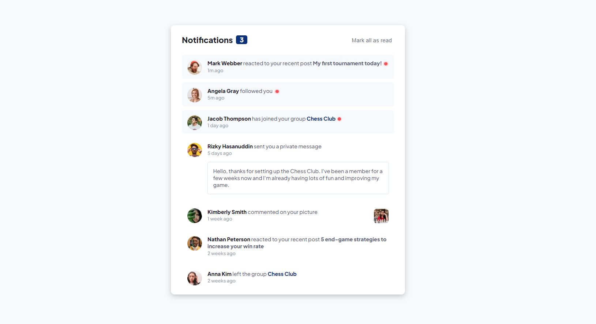

<h1 align="center">Notifications page</h1>

  <h3>
    <a href="https://maciejnarejko.github.io/notifications-page/">
      Live
    </a>
    | 
    <a href="#">
      Solution
    </a>
    | 
    <a href="https://www.frontendmentor.io/challenges/notifications-page-DqK5QAmKbC">
      Challenge
    </a>
  </h3>

</img>

## About the Project

The challenge is to build out notifications page and get it looking as close to the design as possible. For this purpose you can use any tools you like to help you complete the challenge.

Project assumptions:

- "Mark all as read" button toggle the visual state of the unread notifications and set the number of unread messages to zero
- Optimal layout for the interface depending on their device's screen size (375px/1440px)
- Distinguishing between "unread" and "read" notifications
- Bold tags changing color on hover
- Hover and focus states for all interactive elements on the page

Additional assumptions:

- Dynamic Page Title with the number of unread notifications
- Mark a notification on click as read/unread and update the visual state of the unread notifications

This is a solution to the [Notifications page on Frontend Mentor](https://www.frontendmentor.io/challenges/notifications-page-DqK5QAmKbC).

## Built with

- Semantic HTML5 markup
- CSS custom properties
- Grid/Flex
- SASS/SCSS
- React
- JavaScript
- BEM naming convention
- Mobile-first workflow

## Author

- Frontend Mentor - <a href="https://www.frontendmentor.io/profile/MaciejNarejko">@MaciejNarejko</a>

## Acknowledgments

Thanks to the FrontendMentor.io community for a code review.
Together we write better code.
